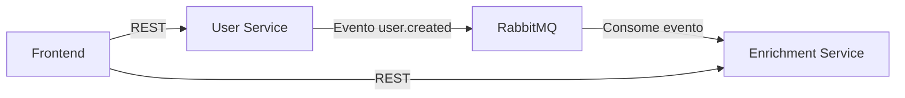

# User Service

Um microserviço RESTful para gerenciamento de usuários, parte de uma arquitetura distribuída em microsserviços. Este serviço é responsável pelo gerenciamento dos dados básicos dos usuários e pela publicação de eventos de mudança de estado através do RabbitMQ.

## 📚 Documentação da API

A documentação completa da API está disponível através do Swagger UI. Após iniciar o serviço, você pode acessar a documentação em:

```
http://localhost:8000/api/documentation
```

### Autenticação

A API utiliza autenticação JWT (JSON Web Token). Para acessar os endpoints protegidos:

1. Registre um novo usuário através do endpoint `/api/auth/register`
2. Faça login através do endpoint `/api/auth/login`
3. Use o token retornado no header `Authorization: Bearer {token}` para as requisições subsequentes

Exemplo de uso do token:

```bash
curl -H "Authorization: Bearer {seu_token}" http://localhost:8000/api/users
```

### Rate Limiting

A API implementa rate limiting para proteger contra abusos. Os limites são:

-   60 requisições por minuto para endpoints públicos (login, registro)
-   30 requisições por minuto para endpoints autenticados

Quando o limite é excedido, a API retorna o status code 429 (Too Many Requests) com o header `Retry-After` indicando o tempo em segundos para a próxima tentativa.

## 🏗️ Arquitetura do Sistema

O sistema é composto por três componentes principais:

1. **Frontend (React)**

    - Interface de usuário
    - Comunica com o user-service via REST

2. **User Service** (este serviço)

    - Gerencia dados básicos dos usuários
    - Usa PostgreSQL como banco de dados
    - Publica eventos no RabbitMQ quando um usuário é criado
    - Serviços disponíveis:
        - API REST: http://localhost:8000
        - PostgreSQL: localhost:5432
        - RabbitMQ: localhost:5672
        - Redis: localhost:6379

3. **Enrichment Service**
    - Consome eventos do RabbitMQ
    - Enriquece dados dos usuários
    - Usa MongoDB para persistência
    - Expõe API REST para consulta de dados enriquecidos

### Fluxo de Comunicação



## 🚀 Como Executar

### Pré-requisitos

-   Docker e Docker Compose instalados
-   Git instalado

### Passo a Passo

1. **Clone os repositórios**

```bash
# User Service
git clone git@github.com:carinavbritto/laravel-user-service.git
cd user-service

# Enrichment Service
git clone git@github.com:carinavbritto/nestjs-enrichment-service.git
cd enrichment-service
```

2. **Configure as variáveis de ambiente**
    - Crie um arquivo `.env` na raiz do projeto com as seguintes variáveis:

```env
APP_NAME="User Service"
APP_ENV=local
APP_KEY=
APP_DEBUG=true
APP_URL=http://localhost:8000

DB_CONNECTION=pgsql
DB_HOST=db
DB_PORT=5432
DB_DATABASE=user_service
DB_USERNAME=postgres
DB_PASSWORD=postgres

REDIS_HOST=redis
REDIS_PASSWORD=null
REDIS_PORT=6379

RABBITMQ_HOST=rabbitmq
RABBITMQ_PORT=5672
RABBITMQ_USER=guest
RABBITMQ_PASSWORD=guest
RABBITMQ_VHOST=/
```

3. **Inicie os serviços na ordem correta**

```bash
# 1. Primeiro, inicie o User Service
cd /caminho/para/user-service
docker-compose up -d

# Aguarde alguns segundos para garantir que todos os serviços estejam rodando
docker-compose ps

# 2. Depois, inicie o Enrichment Service
cd /caminho/para/enrichment-service
docker-compose up -d
```

> ⚠️ **Importante**: O User Service deve ser iniciado primeiro, pois ele cria a rede compartilhada que o Enrichment Service utiliza. Verifique se todos os serviços do User Service estão rodando antes de iniciar o Enrichment Service.

## Tecnologias Utilizadas

-   Laravel 12
-   PostgreSQL 15
-   Redis 7
-   RabbitMQ 3
-   Docker & Docker Compose

## Requisitos

-   Docker (versão 20.10.0 ou superior)
-   Docker Compose (versão 2.0.0 ou superior)
-   PHP 8.2 ou superior (apenas para desenvolvimento local)
-   Composer (apenas para desenvolvimento local)

## Portas Utilizadas

Certifique-se que as seguintes portas estejam disponíveis em sua máquina:

-   8000: API Laravel
-   5432: PostgreSQL
-   6379: Redis
-   5672: RabbitMQ
-   15672: RabbitMQ Management Interface

## Configuração do Ambiente

1. Clone o repositório:

```bash
git clone [URL_DO_REPOSITORIO]
cd user-service
```

2. Crie o arquivo `.env` na raiz do projeto:

```bash
# Copie o arquivo de exemplo
cp .env.example .env

# Edite o arquivo .env com suas configurações
nano .env  # ou use seu editor preferido
```

O arquivo `.env` deve conter as seguintes variáveis (os valores abaixo são exemplos seguros para desenvolvimento local):

```bash
APP_NAME="User Service"
APP_ENV=local
APP_KEY=
APP_DEBUG=true
APP_URL=http://localhost:8000

DB_CONNECTION=pgsql
DB_HOST=db
DB_PORT=5432
DB_DATABASE=user_service
DB_USERNAME=postgres
DB_PASSWORD=postgres

REDIS_HOST=redis
REDIS_PASSWORD=null
REDIS_PORT=6379

RABBITMQ_HOST=rabbitmq
RABBITMQ_PORT=5672
RABBITMQ_USER=guest
RABBITMQ_PASSWORD=guest
RABBITMQ_VHOST=/
```

> **Nota de Segurança**:
>
> -   O arquivo `.env.example` contém configurações padrão para desenvolvimento local
> -   Para ambientes de produção, use credenciais mais seguras
> -   Nunca compartilhe seu arquivo `.env` real
> -   Mantenha suas credenciais seguras e nunca as inclua em repositórios públicos

3. Inicie os containers:

```bash
docker-compose up -d --build
```

4. Verifique se todos os containers estão rodando:

```bash
docker-compose ps
```

Você deve ver todos os containers com status "Up".

5. Instale as dependências do Composer:

```bash
docker-compose exec app composer install
```

6. Gere a chave da aplicação:

```bash
docker-compose exec app php artisan key:generate
```

7. Execute as migrações:

```bash
docker-compose exec app php artisan migrate
```

## Verificando o Ambiente

1. Teste a API:

```bash
curl http://localhost:8000/api/users
```

Deve retornar um array vazio `[]` ou uma lista de usuários.

2. Verifique os logs da aplicação:

```bash
docker-compose logs -f app
```

3. Verifique os logs do RabbitMQ:

```bash
docker-compose logs -f rabbitmq
```

## Comandos Úteis

-   Parar todos os containers:

```bash
docker-compose down
```

-   Reconstruir e reiniciar os containers:

```bash
docker-compose down && docker-compose up -d --build
```

-   Limpar o cache do Laravel:

```bash
docker-compose exec app php artisan cache:clear
```

-   Verificar status dos serviços:

```bash
docker-compose ps
```

## Solução de Problemas

1. Se a API não estiver respondendo:

    - Verifique se o container `app` está rodando: `docker-compose ps`
    - Verifique os logs: `docker-compose logs app`
    - Tente reconstruir o container: `docker-compose up -d --build app`

2. Se o banco de dados não estiver acessível:

    - Verifique se o container `db` está rodando: `docker-compose ps`
    - Verifique os logs: `docker-compose logs db`
    - Tente reconstruir o container: `docker-compose up -d --build db`

3. Se o RabbitMQ não estiver funcionando:
    - Verifique se o container `rabbitmq` está rodando: `docker-compose ps`
    - Verifique os logs: `docker-compose logs rabbitmq`
    - Acesse a interface de gerenciamento: http://localhost:15672 (guest/guest)

## Endpoints da API

### Listar Usuários

```bash
GET http://localhost:8000/api/users
```

### Criar Usuário

```bash
POST http://localhost:8000/api/users
Content-Type: application/json

{
    "name": "Nome do Usuário",
    "email": "email@exemplo.com"
}
```

### Buscar Usuário por ID

```bash
GET http://localhost:8000/api/users/{id}
```

### Atualizar Usuário

```bash
PUT http://localhost:8000/api/users/{id}
Content-Type: application/json

{
    "name": "Novo Nome",
    "email": "novo@email.com"
}
```

### Deletar Usuário

```bash
DELETE http://localhost:8000/api/users/{id}
```

## Eventos

Quando um usuário é criado, o serviço publica uma mensagem no RabbitMQ com o seguinte formato:

```json
{
    "event": "user.created",
    "payload": {
        "uuid": "uuid-v4",
        "name": "Nome do Usuário",
        "email": "email@exemplo.com",
        "created_at": "2024-03-20T10:00:00Z"
    }
}
```

## Acessando os Serviços

### User Service

-   **API REST**: http://localhost:8000
-   **PostgreSQL**: localhost:5432
-   **RabbitMQ**: localhost:5672
-   **RabbitMQ Management UI**: http://localhost:15672
    -   Usuário: guest
    -   Senha: guest
-   **Redis**: localhost:6379

### Enrichment Service

-   **API REST**: http://localhost:3000

## Justificativa das Escolhas Tecnológicas

1. **Laravel 12**: Framework PHP moderno com excelente suporte a APIs REST, ORM robusto e sistema de filas integrado.

2. **PostgreSQL**: Banco de dados relacional robusto e confiável, com suporte nativo a UUID e excelente performance.

3. **RabbitMQ**: Message broker confiável para comunicação assíncrona entre serviços, permitindo desacoplamento e escalabilidade.

4. **Redis**: Cache em memória para melhorar a performance e gerenciar sessões.

5. **Docker**: Containerização para garantir consistência entre ambientes de desenvolvimento e produção.

## Estrutura do Projeto

```
user-service/
├── app/
│   ├── Http/
│   │   └── Controllers/
│   │       └── UserController.php
│   │
│   ├── Models/
│   │   └── User.php
│   │
│   └── Services/
│       └── RabbitMQService.php
├── database/
│   └── migrations/
│       └── create_users_table.php
├── routes/
│   └── api.php
├── docker-compose.yml
└── Dockerfile
```

## Testes

O projeto inclui testes unitários e de integração. Para executar os testes:

```bash
# Executar todos os testes
docker-compose exec app php artisan test

# Executar testes específicos
docker-compose exec app php artisan test --filter=UserTest
```

### Cobertura de Testes

-   Testes unitários para o modelo User
-   Testes de integração para a API
-   Testes do serviço RabbitMQ
-   Testes de validação de dados

## Validação de Dados

O serviço implementa validação robusta para todos os endpoints:

### Criar Usuário

-   Nome: obrigatório, mínimo 3 caracteres
-   Email: obrigatório, formato válido, único no sistema

### Atualizar Usuário

-   Nome: opcional, mínimo 3 caracteres
-   Email: opcional, formato válido, único no sistema (exceto para o próprio usuário)

### Respostas de Erro

```json
{
    "error": "Validation failed",
    "messages": {
        "email": ["O email já está em uso"],
        "name": ["O nome deve ter pelo menos 3 caracteres"]
    }
}
```

## Monitoramento e Logs

### Logs da Aplicação

Os logs são armazenados em `storage/logs/laravel.log` e incluem:

-   Requisições HTTP
-   Erros e exceções
-   Eventos do RabbitMQ
-   Queries do banco de dados

### Monitoramento

-   RabbitMQ Management Interface: http://localhost:15672
    -   Monitoramento de filas
    -   Métricas de performance
    -   Status dos consumidores

### Métricas

-   Taxa de requisições
-   Tempo de resposta
-   Uso de recursos
-   Status dos serviços

## ⚠️ Troubleshooting

### Erro de rede não encontrada

Se você receber o erro `network user-service-network declared as external, but could not be found`, significa que o User Service não foi iniciado primeiro. Execute:

```bash
# 1. Pare o Enrichment Service
cd /caminho/para/enrichment-service
docker-compose down

# 2. Inicie o User Service
cd /caminho/para/user-service
docker-compose up -d

# 3. Aguarde alguns segundos e verifique se todos os serviços estão rodando
docker-compose ps

# 4. Inicie o Enrichment Service novamente
cd /caminho/para/enrichment-service
docker-compose up -d
```

### Serviço não inicia

```bash
# Verifique os logs
docker-compose logs -f app
```

### Erro de conexão com RabbitMQ

```bash
# Verifique se o RabbitMQ está rodando
docker-compose ps

# Verifique os logs do RabbitMQ
docker-compose logs -f rabbitmq
```

-   Status dos serviços

## 🔄 Eventos Publicados

O User Service publica os seguintes eventos no RabbitMQ:

### user.created

Publicado quando um novo usuário é criado.

```json
{
    "event": "user.created",
    "payload": {
        "uuid": "uuid-v4",
        "name": "Nome do Usuário",
        "email": "email@exemplo.com",
        "created_at": "2024-03-20T10:00:00Z"
    }
}
```

### user.updated

Publicado quando um usuário existente é atualizado.

```json
{
    "event": "user.updated",
    "payload": {
        "uuid": "uuid-v4",
        "name": "Novo Nome",
        "email": "novo@email.com",
        "updated_at": "2024-03-20T11:00:00Z"
    }
}
```

### user.deleted

Publicado quando um usuário é deletado.

```json
{
    "event": "user.deleted",
    "payload": {
        "uuid": "uuid-v4",
        "deleted_at": "2024-03-20T12:00:00Z"
    }
}
```

## 🔌 Integração com Outros Serviços

### Enrichment Service

-   Consome eventos `user.created` para enriquecer os dados do usuário
-   Mantém uma cópia dos dados básicos do usuário em seu próprio banco MongoDB
-   Expõe endpoints REST para consulta de dados enriquecidos

### Frontend

-   Comunica-se diretamente com o User Service para operações CRUD básicas
-   Consulta o Enrichment Service para obter dados enriquecidos
-   Implementa tratamento de erros e retry para garantir resiliência

## 🛡️ Resiliência e Tratamento de Erros

### Retry Policy

-   Implementa retry exponencial para falhas de comunicação
-   Máximo de 3 tentativas para operações críticas
-   Backoff exponencial entre tentativas

### Circuit Breaker

-   Monitora a saúde dos serviços dependentes
-   Abre o circuito após múltiplas falhas
-   Permite recuperação gradual

### Logging e Monitoramento

-   Logs detalhados de todas as operações
-   Métricas de performance e saúde
-   Alertas para falhas críticas
